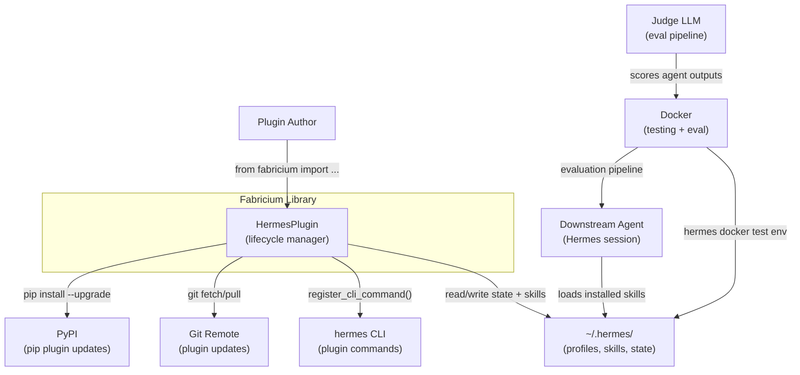
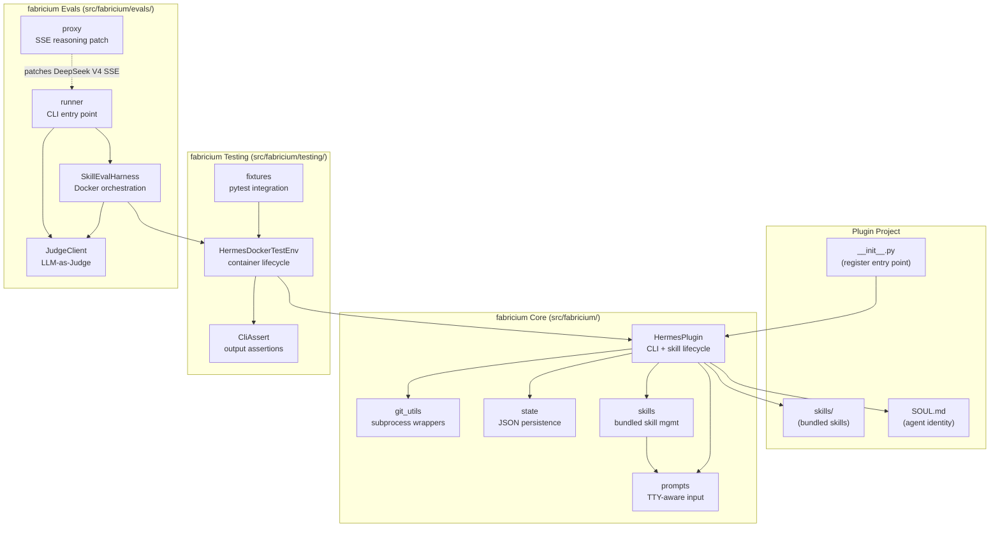

# Architecture

## System Context (C4 Level 1)



## Container Diagram (C4 Level 2)



## Data Flow: Plugin Update

```
hermes <name> update
    │
    ├─► _resolve_update_mode()          # --git/--pip or auto-detect (pip-first)
    │
    ├── [pip path] ──────────────────────
    │   ├─► _get_hermes_python()        # Find Hermes's managed Python
    │   ├─► pip --version               # Check pip available
    │   ├─► pip install --upgrade <name> # Upgrade the plugin
    │   └─► (falls back to git if pip missing + user didn't --pip)
    │
    ├── [git path] ──────────────────────
    │   ├─► git_utils.is_git_repo()
    │   ├─► git_utils.fetch_remote()
    │   ├─► git_utils.get_ahead_behind()
    │   └─► git_utils.pull_branch()
    │
    ├─► pip install --upgrade fabricium  # Auto-update dependency
    │
    └─► _sync_installed_profiles()       # Refresh skills + SOUL.md
         ├─► skills.get_bundled_skill_names()
         ├─► skills.remove_stale_from_profile()
         ├─► skills.install_bundled_skills()
         └─► _apply_soul_md()
```

## Data Flow: Eval Pipeline

```
python -m fabricium.evals.runner
    │
    ├─► load_config()                    # Env vars → EvalConfig
    ├─► SkillEvalHarness.add_profile()   # bare + jovaltus-agent
    ├─► harness.run()
    │    ├─► _start_container()          # Docker with mounted HERMES_HOME
    │    ├─► _setup_profiles()           # hermes profile create + config
    │    └─► for each task:
    │         ├─► _init_workspace()      # git init, seed files
    │         ├─► _run_agent() × N       # hermes -p <profile> chat
    │         ├─► capture file_tree, build_results, git_commits
    │         └─► _judge_task()          # JudgeClient.evaluate()
    │
    └─► report.to_json()                 # Write eval_results/report_*.json
```

## Key Architectural Decisions

| Decision | Rationale | Status |
|----------|-----------|--------|
| Zero runtime dependencies | Plugins importing fabricium must not pollute Hermes's venv. All subprocess/HTTP via stdlib. | Active |
| src layout (`src/fabricium/`) | Prevents accidental imports of the source tree during development. Required for hatchling editable installs. | Active |
| Library, not framework | Plugins import fabricium — fabricium doesn't control plugins. Any behaviour can be bypassed. | Active |
| JSON state files at `~/.hermes/` | Survives plugin updates, shared across profiles. Simple, no database dependency. | Active |
| State-based stale skill detection | Previous approach scanned target dir and could cross-touch other plugins' skills. Now caller provides exact stale set from per-profile state. | Active |
| LLM-as-Judge with position randomisation | Reduces order bias. Judge and candidate should use different providers to avoid self-preference. | Active |
| Reasoning-model SSE proxy | DeepSeek V4 outputs `content: null` during reasoning → Hermes sees empty stream. Proxy patches `content: null` → `content: ""`. | Active |
| Convention over configuration | `default_profile`, standard paths, sensible defaults. 99% of plugins need zero config. | Active |
| Hermes-managed Python for pip | `_get_hermes_python()` locates `~/.hermes/.venv/bin/python3` (or `Scripts/python.exe` on Windows) instead of relying on `sys.executable`, which may point to the system Python on Windows. Prevents `pip install` from targeting the wrong environment. Fallback to `sys.executable` when no managed venv exists. | Active |

## How to Update

- New service/external dependency? → Add to system context diagram.
- New subpackage? → Add to container diagram.
- Data flow changed? → Update sequence diagram.
- New architectural decision? → Add row to decisions table. Mark inferred rationale as `[INFERRED]`.

## Find It Fast

```bash
grep -r "class HermesPlugin" src/fabricium/__init__.py     # Core class
grep -r "def register" src/fabricium/__init__.py            # Entry point
grep -r "class SkillEvalHarness" src/fabricium/evals/       # Eval orchestrator
grep -r "class HermesDockerTestEnv" src/fabricium/testing/  # Test harness
```
